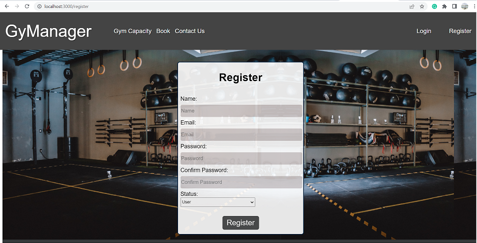
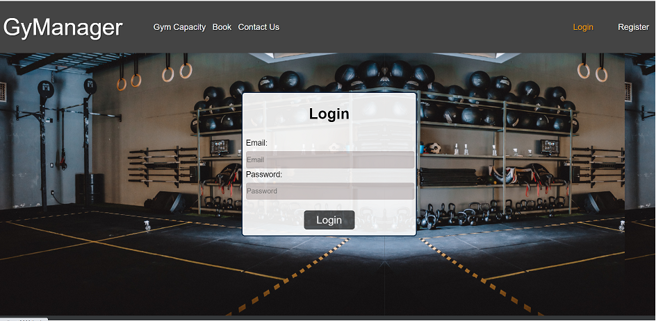
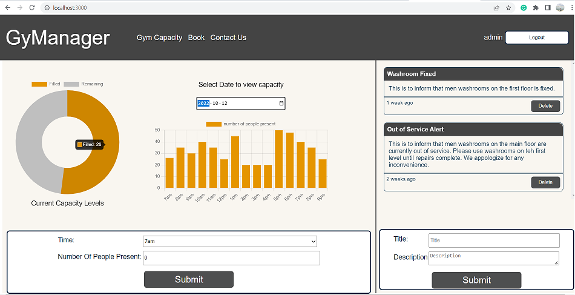
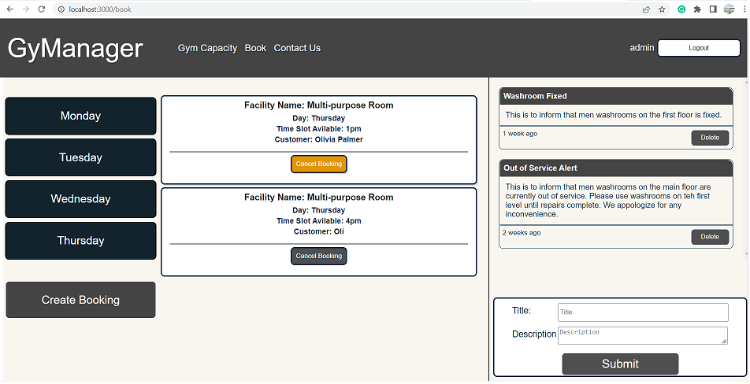
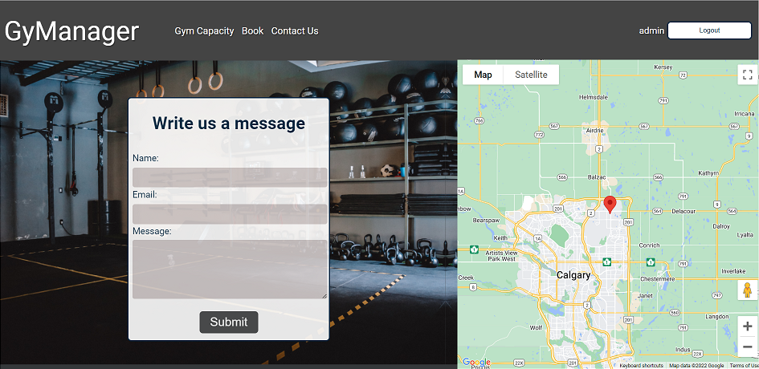

# GyManager

GyManager front-end is a facility management app with the following few core features at the moment:

# Access Levels

GyManager has follwing interfaces with custmozied access as follows:

## Admin: 
Can read/write bookings
Can read/write posts to the bulletin board
Can read/write capaity informtaion to the database

## User
Can read/write bookings
Can read posts from the bulletin board
Can read capaity informtaion from the database

GyManager makes use of the follwing tech stack:

Front-end: React, Bootstrap, HTML, CSS
Back-end: NodeJS, Express
Database: PostgreSQL
Additional: CORS, XSS, helmet, cookie-parser, morgan, useForm, useContext, timeago, nodemon

 clone back-end from: <https://github.com/ZaSal1990/gymanager_api>

# Run Project

 run `npm start`

 Login as admin:
 username: `abc@admin.com`
 password: `admin`

Login as user:
username: `abc@user.com`
password: `user`

# User Stories
 
 As a user, I can select a day and view bookings for the day
 As a user, I can create booking for the user
 As a user, I can view posts on bulletin board
 As a user, I can see gym capacity for the time/day selected
 As an admin, I can post to bulletin board
 As an admin, I can add current capacity level of the gym
 As an admin I can

 # Screenshots

- We can register as a user or an admin.
  - 

- We can log in as a user or an admin. As an admin, we can fill out a bulletin form and a capacity form. As a user, we can not edit capacity graphs or post bulletins. We can only view them.
  - 

- We can see two graphs. The doughnut graph shows the capacity level of the present hour. We can select any date and can see the capacity level for that whole day on the Bar graph. On the right-hand side is the bulletin board.
  - 

- We can book a facility room for any specific day or time of the week. We can cancel the booking as well. 
  -  

- On the contact us page, a user fill out the form to send any message to the admin. On the right is a google map to show the location of our facility. 
  -  

# Dependencies

- ReactJS
- Axios
- Node.js
- react-chartjs-2
- emailjs
- react-google-maps
- useContext
- React Router
- hooks
